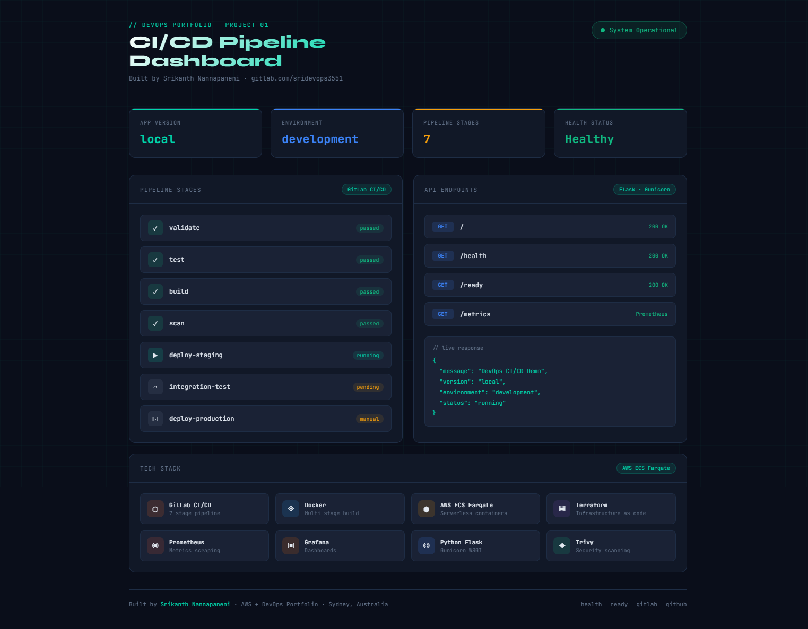
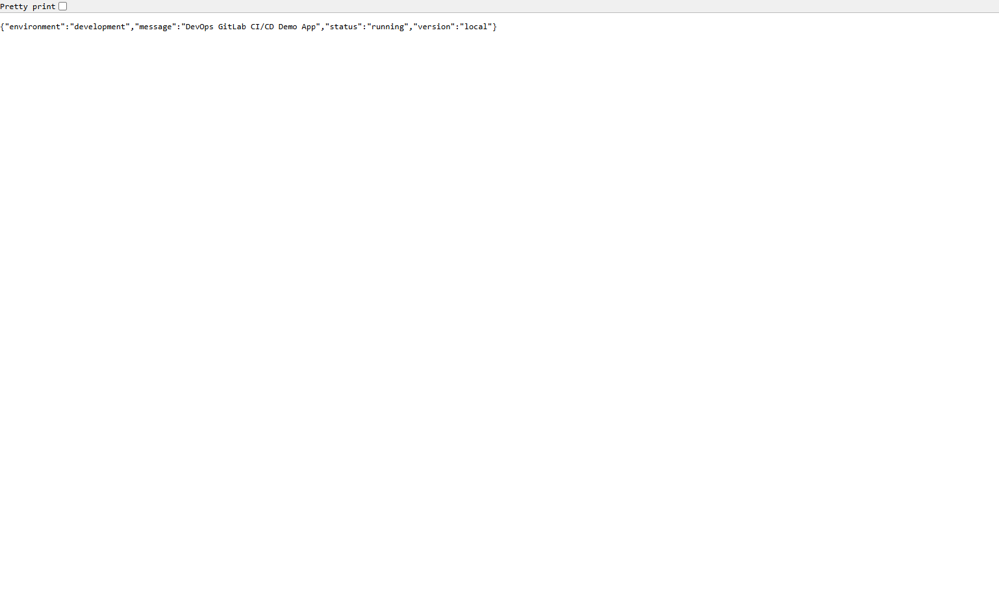
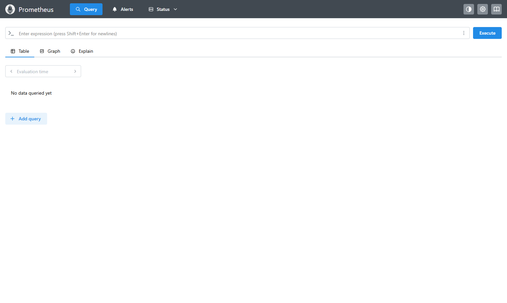
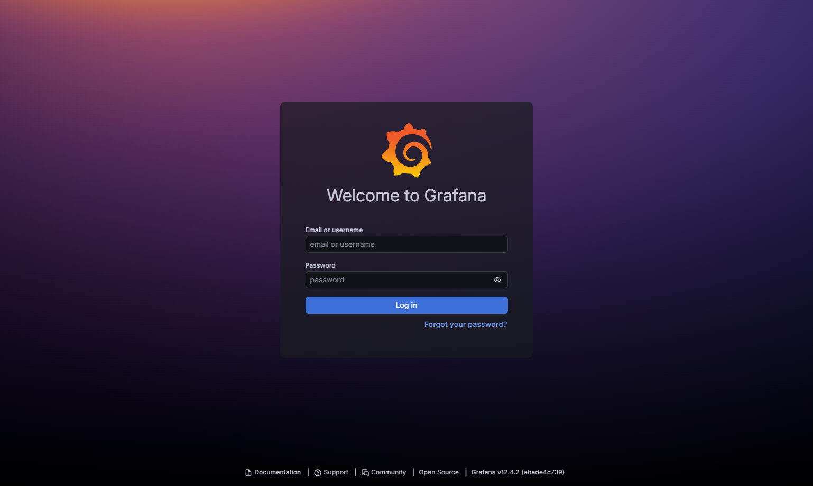

# Test Evidence — GitLab CI/CD Pipeline

Tested locally on 26 March 2026.
Stack: Docker Desktop, Python Flask, Prometheus, Grafana

## 1. Dashboard UI

## 2. Health endpoint

## 3. Ready endpoint

## 4. API endpoint

## 5. Prometheus UI

## 6. Grafana UI
